# Development Workflow

```mermaid
flowchart TD
    START([🚀 开始]) --> PRECHECK

    subgraph EDIT["✏️ 编辑阶段"]
        PRECHECK["git status --short\n检查工作区状态"]
        PRECHECK --> NEWBRANCH["⭐ git checkout -b <type>/<name>\n首次提交前必须建分支\n绝不直接提交 main\n（纯文档变更同样适用）"]
        NEWBRANCH --> CODE["编辑 src/host/*.js\n或 src/client/*.js"]
        CODE --> BUILD["npm run build\n合并 fragments → lib/"]
        BUILD --> TEST["npm test\n单元测试"]
        TEST --> FAIL{通过?}
        FAIL -- ❌ --> CODE
        FAIL -- ✅ --> CHECK["npm run check\n构建产物完整性校验"]
        CHECK --> DOCSYNC["⭐ 文档同步检查\nrg 本次改变的事实：\n版本号 / API 签名 / 导出名\n事件名 / 限制 / 默认值"]
        DOCSYNC --> DOCOK{文档均已同步?}
        DOCOK -- ❌ --> FIXDOC["同步更新文档\nREADME×2 / AGENTS / CONTEXT\ndocs/WORKFLOW / 视觉规格 / adr"]
        FIXDOC --> DOCSYNC
        DOCOK -- ✅ --> DIFF["git diff --stat\ngit diff\n审查变更"]
    end

    subgraph DEPLOY["🚀 本地部署（可选）"]
        DIFF --> RUNDEPLOY["npm run deploy\n① build + test\n② 复制 lib/ + cordis.patch.yml\n③ 复制 node_modules/ 依赖\n④ 原子替换 ~/.dsh/profiles/web/node_modules/\n⑤ 旧版备份到 plugin-backups/"]
        RUNDEPLOY --> RESTART["重启 dsh web\n硬刷新浏览器"]
        RESTART --> LOCALOK{本地功能\n验证通过?}
        LOCALOK -- ❌ --> CODE
    end

    subgraph BRANCH["🌿 PR 阶段"]
        LOCALOK -- ✅ --> GITADD["git add -A\n（分支已在编辑阶段创建）"]
        GITADD --> GITCOMMIT["git commit\nConventional Commit 格式\n代码与文档同一个 PR"]
        GITCOMMIT --> GETTOKEN["github-auth skill\npython3 get_token.py\n① 有缓存 → 直接返回\n② 无缓存 → Device Flow\n   后台运行，读 stderr\n   展示“Open in browser + 设备码”\n   等用户手动浏览器授权\n   用户确认后再取缓存 token\n   缓存至 /tmp/.pi_github_token"]
        GETTOKEN --> PUSHBRANCH["git push https://TOKEN@github.com/...\npush feature branch"]
        PUSHBRANCH --> CREATEPR["GitHub API: POST /repos/.../pulls\ntitle / head / base=main / body"]
        CREATEPR --> MERGEPR["GitHub API: PUT /repos/.../pulls/:n/merge\nmerge_method: squash"]
        MERGEPR --> PULLMAIN["git checkout main\ngit pull origin main"]
    end

    subgraph PREGH["🧪 发布前 GitHub 源安装测试"]
        PULLMAIN --> CLEANGH["清理 profile slot\n删除 package.json 条目\n删除 node_modules/@lujianjun19\n临时设置 git URL 重写（HTTPS 授权）"]
        CLEANGH --> TESTGH["测试 GitHub 源安装（装 main 源码）\ndsh plugin --profile web add\ngithub:lujianjun19/dsh-llm-github-copilot -w"]
        TESTGH --> VERIFYGH{"验证清单\n• 源码构建 lib/ 成功\n• cordis.patch.yml 存在\n• client.js id 正确\n• undici/deps 可 resolve\n• dump-config 识别插件"}
        VERIFYGH -- ❌ --> FIXGH["直接修复\n回到编辑阶段（未打 tag，无需升版）"]
        FIXGH --> CODE
        VERIFYGH -- ✅ --> CLEANUPGH["清理 git URL 重写\n（移除临时 token 注入）"]
    end

    subgraph RELEASE["🏷️ 发布阶段"]
        CLEANUPGH --> ASKREL["⭐ 停下来，询问用户\n‘是否现在发布？将为 vX.Y.Z’\n已合并未发布是合法终态"]
        ASKREL --> APPROVED{用户明确同意发布?}
        APPROVED -- ❌ --> STOPREL([⏸️ 停在此处\n仍可从 GitHub 源安装])
        APPROVED -- ✅ --> CHANGELOG["更新 CHANGELOG.md\n添加版本条目"]
        CHANGELOG --> COMMITCL["git commit\ndocs: update CHANGELOG for vX.Y.Z"]
        COMMITCL --> NPMVER["npm version patch|minor|major\n① preversion: npm test + git diff\n② 更新 package.json version\n③ version: npm run build && git add lib/\n④ 创建 git commit + tag"]
        NPMVER --> PUSHTAG["git push main\ngit push vX.Y.Z tag"]
    end

    subgraph CI["⚙️ GitHub Actions CI"]
        PUSHTAG --> TRIGGER["Release workflow 触发\n(push v* tag)"]
        TRIGGER --> CISTEPS["① npm ci\n② npm run build\n③ npm test\n④ 校验 package.json version == tag\n⑤ npm publish (OIDC Trusted Publishing)\n⑥ gh release create"]
        CISTEPS --> CIPUB{发布成功?}
        CIPUB -- ❌ --> HOTFIX["修复问题\ntag 未 publish 可移动重推；\n已 publish 则重打 patch tag"]
        HOTFIX --> TRIGGER
    end

    subgraph POSTTEST["🧪 发布后 npm 安装测试"]
        CIPUB -- ✅ --> WAITCI["等待 CI: Release workflow\ncompleted | success"]
        WAITCI --> CLEAN["清理 profile slot\n删除 package.json 条目\n删除 node_modules/@lujianjun19\n新版本加入 minimumReleaseAgeExclude"]
        CLEAN --> TESTNPM["测试 npmjs 安装\ndsh plugin --profile web add\n@lujianjun19/...@X.Y.Z\n⚠️ 必须显式版本号，不用 @latest"]
        TESTNPM --> VERIFYNPM{"验证清单\n• version 正确\n• cordis.patch.yml 存在\n• client.js id 正确\n• undici/deps 可 resolve\n• dump-config 识别插件"}
        VERIFYNPM -- ❌ --> HOTFIX
        VERIFYNPM -- ✅ --> DONE
    end

    DONE([✅ 发布完成])

    style EDIT fill:#e8f4fd,stroke:#2196F3
    style DEPLOY fill:#e8f5e9,stroke:#4CAF50
    style BRANCH fill:#fff3e0,stroke:#FF9800
    style PREGH fill:#e0f2f1,stroke:#009688
    style RELEASE fill:#fce4ec,stroke:#E91E63
    style CI fill:#f3e5f5,stroke:#9C27B0
    style POSTTEST fill:#e0f2f1,stroke:#009688
```



## 分支纪律（EDIT 阶段首步）

**每次修改都必须在新分支上，绝不直接提交 `main`。** 分支创建位置在
编辑阶段的**最前面**（而非测试通过之后），因为真正要防的是“随手提交到
`main`”，而不是“忽略推送”：

```bash
git checkout -b fix/<name>     # 或 feat/ 、docs/ 、refactor/
```

纯文档变更同样适用。若发现已经误提交到 `main`，推送前挖回：

```bash
git checkout -b fix/<name>              # 带走已有提交
git checkout main && git reset --hard origin/main
git checkout fix/<name>
```

一个分支承载一个完整变更，**包括它的文档更新**。不要先合并代码 PR、
再补一个文档 PR——两次合并之间，`main` 上的文档描述的是它并不具备的行为。

## 文档同步检查（EDIT 阶段门禁）

代码与文档会**无声地**错位：文档继续描述一个已被本次变更推翻的版本、
签名或约束时，没有任何测试会失败，而下一个 agent 会把这段陈旧文字当作权威。
提交前把本次**改变的事实**在全部文档里 grep 一遍：

```bash
# 把 pattern 换成本次真正改动的事实：
# 版本号 / API 签名 / 导出名 / 事件名 / 限制值 / 默认值
rg -n '<changed-fact>' README.md README.zh.md AGENTS.md CONTEXT.md \
  CHANGELOG.md docs/ --glob '!node_modules'
```

逐个走一遍下表——每份文档拥有不同的断言：

| 文档 | 拥有 | 何时更新 |
| --- | --- | --- |
| `README.md` / `README.zh.md` | 用户可见的依赖、安装、配置 | 支持版本、选项、命令或行为变化。中英文必须同时改。 |
| `AGENTS.md` | agent 契约、工作流、版本依赖 | 规则、支持版本、强制模式或发布步骤变化。 |
| `CONTEXT.md` | 领域术语 | 概念新增、改名，或边界移动。 |
| `docs/WORKFLOW.md` | 开发周期图 | edit → release 周期的任何一步变化。 |
| `docs/VISION_AND_DOCUMENT_HANDOFF.zh-CN.md` | 视觉设计权威 | 它记载的视觉 API、签名、限制或策略变化。它被引用为权威，陈旧签名会主动误导。 |
| `docs/adr/` | 已接受的决策 | 决策被取代时新增一篇 ADR，不要默默改写旧篇。 |
| `CHANGELOG.md` | 已发布历史 | 发布时（见 RELEASE 阶段）。 |

对于**时点快照类**文档（交接规格、ADR），追加一段范围说明，而不是改写历史。

## 发布必须得到用户明确同意（RELEASE 阶段门禁）

**没有用户在当次对话中明确要求发布，不得执行 `npm version`、不得打 tag、
不得推 tag。** 发布不可逆：已发布的版本号永远不能再用于变更后的运行时代码，
提前打 tag 就烧掉一个版本号，并逼出一个一次性的 patch 发布。

「修复 X」「实现 X」「完成 X」**不是**发布请求；合并 PR 也不是。工作合并且
门禁全绿后，停下来询问：

> 是否现在发布？将为 vX.Y.Z。

然后等待明确的肯定答复。只有用户要求发布 / 打 tag / publish / 「走发布流程」
才算授权。

**已合并但未发布是一个完全合理的终态**——它已经可以从 GitHub 源安装。

## GitHub Device Flow 授权（PR 阶段）

推送分支、创建/合并 PR、推 tag 前需要 GitHub token。采用 `github-auth` skill
的 **Device Flow**，且**必须由用户手动授权**：

1. 后台运行 `python3 ~/.pi/agent/skills/github-auth/scripts/get_token.py`，
   把 stdout/stderr 重定向到临时文件（脚本会阻塞轮询）。
2. 从 stderr 读取并向用户展示：
   - `🌐 Open in browser : https://github.com/login/device`
   - `🔑 Enter code : XXXX-XXXX`（设备码，有效期约 899 秒）
3. **等待用户在浏览器完成授权并确认**，不要自行绕过。
4. 用户确认后再次调用 `get_token.py` 取回已缓存的 token（`gho_…`），
   缓存位于 `/tmp/.pi_github_token`，同一 OS 会话内后续调用直接复用、无需再授权。
5. token 只经环境变量传递给 `git push` / GitHub API，绝不回显或写入日志。

## 安装测试顺序（GitHub 源测试前置）

安装测试拆成两处，**GitHub 源安装测试提前到发布前**：

1. **发布前 GitHub 源安装测试**（PR 合并后、RELEASE 打 tag 前）：
   - 此时 main 已含本次改动但尚未打 tag，`github:` 安装直接拉取 main 源码并
     在 profile 内构建 `lib/`。
   - 若验证失败，**直接回到编辑阶段修复**（尚未打 tag、未升版本、未 publish，
     修复成本最低），修好后重新走 EDIT → DEPLOY → PR。
   - 通过后再进入 RELEASE，避免把已知有问题的构建打成正式 tag/发布。
   - 需要 `-w` 与 `pnpm-workspace.yaml` 的 `allowBuilds`，以及一次性的 git URL
     重写（HTTPS 授权）；测试后立即清理该重写。

2. **发布后 npm 安装测试**（CI publish 成功后）：
   - 只验证 npmjs 发布产物（tarball 已由 CI 构建，无需源码构建）。
   - 新版本刚发布时会被 pnpm 的 `minimumReleaseAge` 供应链策略拦截并回退到旧版；
     需先把新版本加入 profile `pnpm-workspace.yaml` 的 `minimumReleaseAgeExclude`。
   - **必须用显式 `@X.Y.Z` 安装，不要用 `@latest`**。实测：即使新版本已在
     `minimumReleaseAgeExclude` 中，`@latest` 仍会解析到上一个版本，并把那个
     旧版本写进 profile 的依赖范围，导致验证清单检查的是错误的构建。
   - 若验证发现版本号不对，说明安装静默回退了：重新清理 profile slot 后用显式
     版本号重装。
   - npm 测试失败进入 HOTFIX：tag 未被 publish 时可移动 tag 重推；已 publish 则
     不可复用版本号，必须重打 patch tag。
