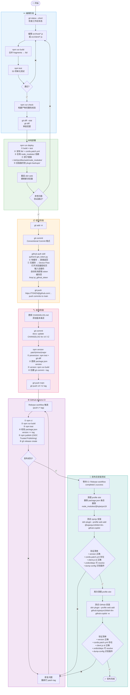

# Development Workflow

```mermaid
flowchart TD
    START([🚀 开始]) --> PRECHECK

    subgraph EDIT["✏️ 编辑阶段"]
        PRECHECK["git status --short\n检查工作区状态"]
        PRECHECK --> CODE["编辑 src/host/*.js\n或 src/client/*.js"]
        CODE --> BUILD["npm run build\n合并 fragments → lib/"]
        BUILD --> TEST["npm test\n53 项单元测试"]
        TEST --> FAIL{通过?}
        FAIL -- ❌ --> CODE
        FAIL -- ✅ --> CHECK["npm run check\n构建产物完整性校验"]
        CHECK --> DIFF["git diff --stat\ngit diff\n审查变更"]
    end

    subgraph DEPLOY["🚀 本地部署"]
        DIFF --> RUNDEPLOY["npm run deploy\n① build + test\n② 复制 lib/ + cordis.patch.yml\n③ 复制 node_modules/ 依赖\n④ 原子替换 ~/.dsh/profiles/web/node_modules/\n⑤ 旧版备份到 plugin-backups/"]
        RUNDEPLOY --> RESTART["重启 dsh web\n硬刷新浏览器"]
        RESTART --> LOCALOK{本地功能\n验证通过?}
        LOCALOK -- ❌ --> CODE
    end

    subgraph COMMIT["📦 提交阶段"]
        LOCALOK -- ✅ --> GITADD["git add -A"]
        GITADD --> GITCOMMIT["git commit\nConventional Commit 格式"]
        GITCOMMIT --> GETTOKEN["github-auth skill\npython3 get_token.py\n① 有缓存 → 直接返回\n② 无缓存 → Device Flow\n   打开浏览器授权页\n   输入设备码\n   自动轮询获取 token\n   缓存至 /tmp/.pi_github_token"]
        GETTOKEN --> PUSH["git push https://TOKEN@github.com/...\npush commits to main"]
    end

    subgraph RELEASE["🏷️ 发布阶段"]
        PUSH --> CHANGELOG["更新 CHANGELOG.md\n添加版本条目"]
        CHANGELOG --> COMMITCL["git commit\ndocs: update CHANGELOG for vX.Y.Z"]
        COMMITCL --> NPMVER["npm version patch|minor|major\n① preversion: npm test + git diff\n② 更新 package.json version\n③ version: npm run build\n④ 创建 git commit + tag"]
        NPMVER --> PUSHTAG["git push main\ngit push vX.Y.Z tag"]
    end

    subgraph CI["⚙️ GitHub Actions CI"]
        PUSHTAG --> TRIGGER["Release workflow 触发\n(push v* tag)"]
        TRIGGER --> CISTEPS["① npm ci\n② npm run build\n③ npm test\n④ 校验 package.json version == tag\n⑤ npm publish (OIDC Trusted Publishing)\n⑥ gh release create"]
        CISTEPS --> CIPUB{发布成功?}
        CIPUB -- ❌ --> HOTFIX["修复问题\n重新打 patch tag"]
        HOTFIX --> TRIGGER
    end

    subgraph POSTTEST["🧪 发布后安装测试"]
        CIPUB -- ✅ --> WAITCI["等待 CI: Release workflow\ncompleted | success"]
        WAITCI --> CLEAN["清理 profile slot\n删除 package.json 条目\n删除 node_modules/@lujianjun19"]

        CLEAN --> TESTNPM["测试 npmjs 安装\ndsh plugin --profile web add\n@lujianjun19/dsh-llm-github-copilot"]
        TESTNPM --> VERIFYNPM{"验证清单\n• version 正确\n• cordis.patch.yml 存在\n• client.js id 正确\n• undici/deps 可 resolve\n• dump-config 识别插件"}
        VERIFYNPM -- ❌ --> HOTFIX

        VERIFYNPM -- ✅ --> CLEAN2["再次清理 profile slot"]
        CLEAN2 --> TESTGH["测试 GitHub 安装\ndsh plugin --profile web add\ngithub:lujianjun19/dsh-llm-github-copilot -w"]
        TESTGH --> VERIFYGH{"验证清单\n• version 正确\n• cordis.patch.yml 存在\n• client.js id 正确\n• undici/deps 可 resolve\n• dump-config 识别插件"}
        VERIFYGH -- ❌ --> HOTFIX
        VERIFYGH -- ✅ --> DONE
    end

    DONE([✅ 发布完成])

    style EDIT fill:#e8f4fd,stroke:#2196F3
    style DEPLOY fill:#e8f5e9,stroke:#4CAF50
    style COMMIT fill:#fff3e0,stroke:#FF9800
    style RELEASE fill:#fce4ec,stroke:#E91E63
    style CI fill:#f3e5f5,stroke:#9C27B0
    style POSTTEST fill:#e0f2f1,stroke:#009688
```
